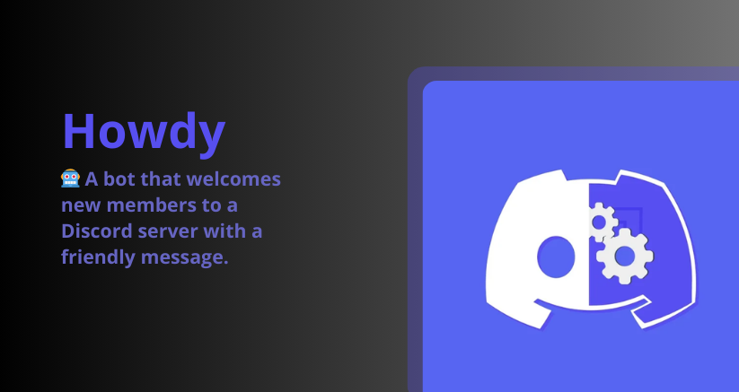

The bot will send a welcome message to users once a certain time threshold or member count is reached. Additionally, the bot will apply emojis to the welcome message that match the emojis from the user's roles.

---

# Index
- [Features](#-features)
- [Technologies Used](#-technologies-used)
- [Getting Started](#-getting-started)
- [Prerequisites](#-prerequisites)
- [Installation](#-installation)
- [How to create a venv (windows)](#-how-to-create-a-venv-(windows))
- [Install and add packages](#-install-and-add-packages)
- [Deployment](#-deployment)
- [Usage](#-usage)
- [File Structure](#-file-structure)
- [Contributing](#-contributing)
- [License](#-license)

---

## Features
- Welcomes new members with a friendly message
- Sends messages after a time or member threshold is reached
- Adds role-based emojis to welcome messages


## Technologies Used
This project is written in Python using the [discord.py](https://github.com/Rapptz/discord.py) framework.


## Getting Started

### Prerequisites
- A Discord account and server
- TBD

### Installation
1. Clone the repository and navigate to the directory: 
```
git clone git@github.com:intelagense/howdy.git
```

### How to create a venv (windows)

#### 1. Open the Integrated terminal in VS Code

Navigate to the menu bar and select **Terminal > New Terminal**.
If the terminal gives you an error in the following steps, try switching to a different terminal type. For example, if PowerShell isn't working, you can switch to Command Prompt or another available terminal.

#### 2. Create the Virtual Environment

In the terminal, navigate to your project directory (if not already there) and run the following command to create a virtual environment:

```sh
py -3 -m venv .venv
```

here `.venv` is the name of your virtual environment.

#### 3. Activate the Virtual Environment

Activate the virtual environment using the following command:

```sh
.venv\Scripts\activate
```

After activation, you should see (.venv) at the beginning of the terminal prompt, indicating that the virtual environment is active.

#### 4. Select the Python Interpreter

VS Code needs to know that you are using a virtual environment. To select the interpreter:

1. Press Ctrl+Shift+P to open the Command Palette.
2. Type Python: Select Interpreter and select it.
3. Choose the interpreter located in the env folder. It should look something like this:
   `.venv\Scripts\python.exe`

#### 5. Deactivate the Virtual Environment

When you are done working, you can deactivate the virtual environment by running:

```sh
.venv\Scripts\deactivate
```

### Install and add packages
---
**Make sure to have pip installed** 
Once you have cloned the project, you should see a `requirements.txt` file. This file contains the list of required packages.

#### 1. Install the required packages
In another file you can see how to setup the venv, make sure you have done this.

With the virtual environment activated, install the required packages listed in requirements.txt:
```sh
pip install -r requirements.txt
```
This command reads the requirements.txt file and installs all listed packages into your virtual environment

#### 2. Verify Package Installation
To ensure that all packages are installed correctly, you can list the installed packages:
```sh
pip list
```

#### 3. Adding your own packages
If you need to add additional packages to this project:

1. Install the package using pip:
```sh
pip install <package_name>
```

2. Update requirements.txt to include the new package:
```sh
pip freeze > requirements.txt
```
This command will overwrite the existing requirements.txt file with a new list of all installed packages and their versions.

<mark>Never do this without installing the requirements first.</mark>

### Run the bot:
```
TBD
```


## Deployment 
(TBD)


## Usage
(TBD)


## File Structure 
```
howdy-bot/
├── start here
└── TBD
```

## Contributing
We welcome contributions to this project! If you have an idea for a new feature or have found a bug, please [open an issue](https://github.com/intelagense/howdy/issues). If you'd like to contribute code, please create a pull request.


## License
This project is licensed under the Apache License, Version 2.0. See the [LICENSE](LICENSE) file for details.
